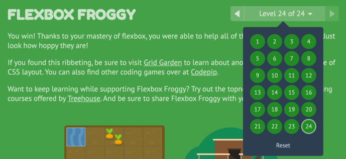

# Week 3 Agenda

## Studio

### Tuesday, 2/4

- Theory of Color
- Intro to typography
- Interface Design Analysis
- 15 minute excersise
- Question for '?'

### Homework

- Use both HTML and CSS. Only use the following CSS properties: Padding Border, margin, position, display, float, top, right, bottom, left, height, width, background-color, Color

### Thursday, 2/6

- G-E-S-T-A-L-T
- Form vs Content
- Navigation design
- 15 minute excersise

### Homework

- Use both HTML and CSS. In addition to the CSS properties allowed in before, you can use any of the following CSS properties: Font-style, Font-weight, Font-size, Font-family, Text-align, Line-height, Letter-spacing, Text-transform

## Lab

### Friday, 2/7

- [Sophomore Work Collection](https://mailchi.mp/af7239312d45/sophomore-work-collection?e=7372ac6315)
- Discuss "Present a Website to the Class" [schedule](https://docs.google.com/spreadsheets/d/1ZLs2MEZhbOPJz6kPV7nZ0nnJnQ0087rqwlZyL0UbFCY/edit?usp=sharing) and expectations now beginning week 4 (Feb 14)
  ::: tip From the Lab Syllabus...
  Every class will begin with a student presenting on a public website they find interesting. The student is expected to facilitate a discussion with the class to dig into how the site was built. Explanations of features and outstanding questions are expected. These will begin in our week 4 class meeting on Feb 14th. Post your submission on your Github page prior to your week.
  :::
- Review Homework
  <!-- - Review Andrew's [class example site](https://github.com/AndrewLevinson/symmetrical-octo-potato) -->
- [Lesson 3: CSS Styling](../lessons/lab/lesson-3)

### Homework

<!-- - Using only this [HTML starter provided](-disabled), use CSS to create <b>three (3) uniquely styled websites</b>. Consider typography, element positioning, and page layout. -->

- Read [An animated guide to flexbox](https://www.freecodecamp.org/news/an-animated-guide-to-flexbox-d280cf6afc35/)
- Learn Flexbox layout `display: flex` in css by completing [FlexboxFroggy](https://flexboxfroggy.com/)!
  - Take a screenshot of the levels dropdown to show me that you've completed these exercises!
  - Add it to your Github by the start of next class
    - It's okay if you miss some, but most should be colored <b>green</b>
    - 

<b>Due Date:</b> Due by next lab, 2/14
