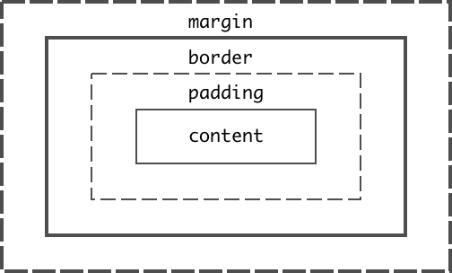

# Let's Talk Style

## Review Folder Structure

#### Basic folder structure and hierarchy for course repo.

- Let's open the repo and consider some organization. I will commit work to my [instructor class repo](https://github.com/AndrewLevinson/symmetrical-octo-potato) so you can refer back to it later

  ::: warning
  Git tracks more than the changes to your content in your code files. It's tracking everything inside your repository including changes to folder structure, naming, additions, deletions, etc.
  :::

## HTML Review

Your main resource for HTML documentation on elements should be [Mozilla's documentation](https://developer.mozilla.org/en-US/docs/Web/HTML/Element).

::: tip Live Coding Activity!
Let's add HTML to Andrew's fake course site together. I'll take suggestions from the class.
:::

#### Key Takeaways

- Remember to always have your Developer Tools open while you code

  - In Chrome: `View` > `Developer` > `Developer Tools`

- Basic HTML scaffolding:

```html
<!DOCTYPE html>
<html lang="en">
  <head>
    <meta charset="UTF-8" />
    <meta name="viewport" content="width=device-width, initial-scale=1.0" />
    <title>My Title</title>
    <!-- your stylesheet links go here -->
  </head>
  <body>
    <!-- visible content goes here -->
  </body>
</html>
```

- Remember proper indentation: you may use a code formatter like [Prettier](https://marketplace.visualstudio.com/items?itemName=esbenp.prettier-vscode)
  - You can even add `formatOnSave` to auto format every time you save you changes
- Remember proper semantic tags like `nav`, `section`, `main`, `header`, `footer` and type hierarchy. <i>Don't settle for a `div` when there's a better tag out there.</i>

<br>

---

<b>Let's take a break? :sweat_smile:</b>

---

<br>

## CSS [Cascading Style Sheets]

#### 3 ways to add CSS to your document.

- Inline
- Directly inside the `head` of your html document
- External Stylesheet :clap:

```html
<head>
  ...
  <!-- external stylesheet links go here -->
  <link rel="stylesheet" href="style.css" />

  <!-- You can write styles that apply to the entire document 
  directly in the head in a style tag -->
  <style>
    body {
      padding: 0;
      margin: 0;
      color: #333;
    }
  </style>
</head>
<body>
  <!-- inline styles are added directly to HTML tag with a style attribute -->
  <main style="background-color: blue"></main>
</body>
...
```

#### Targetting CSS

- Selectors: `tags`, `.classes`, `#ids`
- `property`: `value` pair syntax

```css
/* selecting a tag */
h3 {
  font-size: 30px; /* notice the property:value syntax */
  color: blue;
}

/* selecting a class */
.project-block {
  border: 1px dashed #333;
  padding: 5px;
  margin: 10px 5px 10px 5px;
}

/* selecting an ID */
#container {
  width: 90%;
  margin: 0 auto;
  font-family: 'Retina', 'Helvetica', sans-serif;
}
```

[This is a reference for every css property you can use](https://developer.mozilla.org/en-US/docs/Web/CSS/Reference)

#### Everything in CSS is a box.

- 

::: tip Live Coding Activity!
Let's add CSS to Andrew's fake course site together.
:::

---

Get started on the [homework](../../agendas/week-3.html#homework-3)

<!-- [The CSS Cascade](https://wattenberger.com/blog/css-cascade) -->

<!-- https://browserdefaultstyles.com/

https://developer.mozilla.org/en-US/docs/Web/CSS/color_value#colors_table -->
